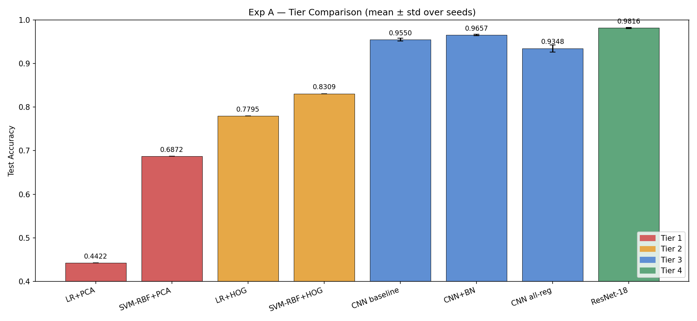
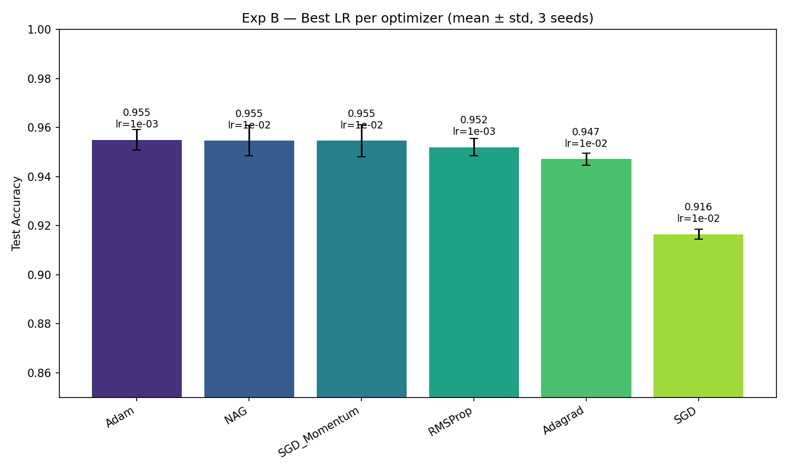
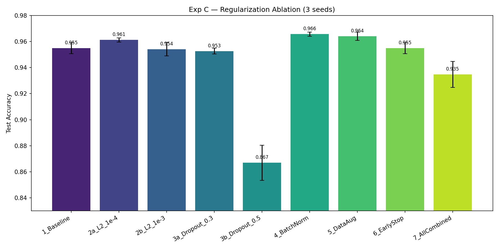
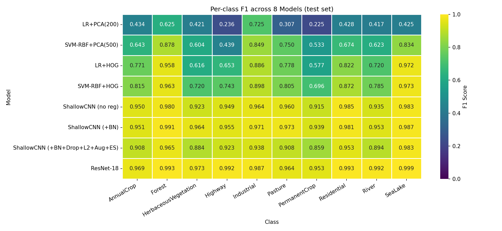
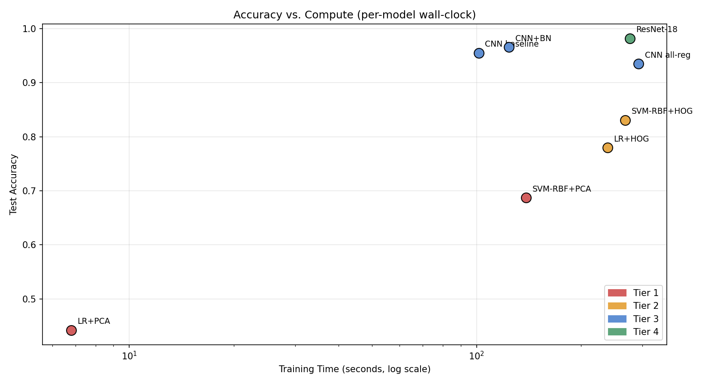

# From SVMs to ResNets: Satellite Land-Use Classification on EuroSAT

> **CMPE 257 — Machine Learning, San José State University**
> Team: Ekant Kapgate, Saransh Soni, Vineet Malewar, Yashashav Devalapalli Kamalraj
> Public repo: https://github.com/yashashav-dk/cmpe257-eurosat
> Final report: [`report/final_report.pdf`](report/final_report.pdf) (30 pages)

A controlled, tier-stratified study of land-use classification on EuroSAT RGB. Four model families compared on a single fixed seed-42 stratified split, with two systematic ablations on the shallow CNN.

---

## TL;DR

| Tier | Best model | Test acc | Macro-F1 | ROC-AUC |
|---|---|---|---|---|
| **T1** Pixel + PCA classical | SVM-RBF, PCA(500), cuML | 0.6872 | 0.6826 | 0.9252 |
| **T2** Handcrafted features classical | SVM-RBF + HOG (1860-D) | 0.8309 | 0.8271 | 0.9701 |
| **T3** Shallow CNN (391K params) | ShallowCNN + BatchNorm | 0.9657 ± 0.0013 | 0.9648 | 0.9987 |
| **T4** ResNet-18 transfer learning | ResNet-18 fine-tuned (3 seeds) | **0.9816 ± 0.0016** | 0.9812 | 0.9997 |

Tier monotonicity holds. Largest jump T2→T3 (+12.4pp); T3→T4 only +1.6pp despite 28× parameter count.

**Statistical significance** (paired t-test on 3-seed triples):
- ResNet-18 vs ShallowCNN+BN: p=0.011 ✓
- ShallowCNN baseline vs +BN: p=0.072 (marginal at 3 seeds)
- ShallowCNN baseline vs ResNet-18: p=0.003 ✓

---

## Research Questions and Headline Findings

### RQ1 — How does accuracy scale across the tier hierarchy?
**Confirmed monotonic** (T1 < T2 < T3 < T4). Largest single gain at the handcrafted→learned-features boundary (+12.4pp). Beyond that, ImageNet transfer adds only +1.6pp at 28× parameters and 2.7× compute → **representation learning is where the win is, depth is diminishing returns at this dataset scale.**

### RQ2 — Which optimizer best trains the shallow CNN?
54-run ablation (6 optimizers × 3 LRs × 3 seeds, 100 epochs each, no early stopping):

| Optimizer | Best LR | Test acc | Conv@90% val |
|---|---|---|---|
| **Adam** | 1e-3 | 0.9550 ± 0.0042 | **10 ep** |
| NAG | 1e-2 | 0.9547 ± 0.0063 | 13 ep |
| SGD+Momentum | 1e-2 | 0.9546 ± 0.0066 | 14 ep |
| RMSProp | 1e-3 | 0.9519 ± 0.0036 | 14 ep |
| Adagrad | 1e-2 | 0.9472 ± 0.0024 | 21 ep |
| SGD | 1e-2 | 0.9165 ± 0.0021 | 79 ep |

Top 4 tied within 0.3pp. **Wilson et al. (2017) hypothesis NOT confirmed.** Adam wins on speed (10 ep to 90%), not asymptotic accuracy.

### RQ3 — Which regularization technique best closes the train/test gap?
27-run ablation (9 configs × 3 seeds, Adam lr=1e-3 fixed):

| Config | Test acc | Train/test gap |
|---|---|---|
| **BatchNorm** alone | **0.9657 ± 0.0016** | +0.028 |
| DataAugmentation | 0.9641 ± 0.0031 | +0.023 |
| L2 (λ=1e-4) | 0.9612 ± 0.0016 | +0.031 |
| Baseline (no reg) | 0.9550 ± 0.0034 | +0.035 |
| Dropout (p=0.3) | 0.9527 ± 0.0022 | -0.011 |
| **AllCombined** (BN+Drop+L2+Aug+ES) | 0.9348 ± 0.0099 | -0.056 |
| Dropout (p=0.5) | 0.8669 ± 0.0135 | -0.015 |

**BN alone is the strongest single regularizer.** Stacking all five techniques OVER-regularizes (-3pp vs BN alone). EuroSAT is sufficiently clean that one well-tuned regularizer suffices.

---

## Per-Class Hardest vs Easiest

| Class | Mean F1 across 8 models | ResNet-18 F1 |
|---|---|---|
| **PermanentCrop** | 0.71 | 0.953 |
| Highway | 0.74 | 0.989 |
| HerbaceousVegetation | 0.76 | 0.973 |
| River | 0.79 | 0.989 |
| AnnualCrop | 0.81 | 0.969 |
| Pasture | 0.81 | 0.970 |
| Residential | 0.84 | 0.996 |
| SeaLake | 0.89 | 0.999 |
| Industrial | 0.90 | 0.991 |
| Forest | 0.92 | 0.994 |

The four crop-family classes (PermanentCrop, AnnualCrop, HerbaceousVegetation, Pasture) are the consistent bottleneck across every tier. RGB resolution alone cannot fully disambiguate them — multispectral inputs (Sentinel-2 NIR + red-edge) are the most likely route to closing this gap. See report §7.4 + Appendix B.

---

## Repository Structure

```
cmpe257-eurosat/
├── README.md                              # this file
├── .gitignore                             # excludes ~780MB caches + dataset
├── data/
│   └── download_eurosat.py                # Zenodo download + extraction
├── src/
│   ├── config.py                          # SEED, paths, hyperparams (single source)
│   ├── data_loader.py                     # stratified split, GPU TensorDataset
│   ├── features.py                        # PCA, HOG, color histograms
│   ├── evaluate.py                        # unified metric suite
│   ├── visualize.py                       # all plot helpers
│   ├── train.py                           # training loop with AMP + ES
│   └── models/
│       ├── classical.py                   # LR + LinearSVC + RBF-SVC wrappers
│       ├── shallow_cnn.py                 # 391K-param toggleable BN/Dropout
│       └── resnet18.py                    # transfer-learning wrapper
├── results/
│   ├── figures/                           # 16+ PNG plots
│   ├── tables/                            # 9 CSVs (per-tier results, summaries)
│   ├── exp_b/all_runs.json                # 54 optimizer-ablation runs (full per-epoch logs)
│   ├── exp_c/all_runs.json                # 27 regularization-ablation runs
│   ├── resnet/all_runs.json               # 3 ResNet-18 seed runs
│   └── predictions/all_predictions.json   # y_pred for all 8 Exp-A models
├── report/
│   ├── final_report.tex                   # 93 KB LaTeX source
│   └── final_report.pdf                   # 30-page compiled report
├── commits.txt                            # autonomous commit log (~25 entries)
└── state.json                             # final pipeline state (all gates passed)
```

---

## Reproduction (from scratch)

### One-Click Reproduction Notebook

For the easiest reproduction path, open [`notebooks/cmpe257_eurosat_reproduction.ipynb`](notebooks/cmpe257_eurosat_reproduction.ipynb) in Google Colab (free GPU sufficient for `RUN_MODE="quick"`):

```
[Open in Colab] https://colab.research.google.com/github/yashashav-dk/cmpe257-eurosat/blob/main/notebooks/cmpe257_eurosat_reproduction.ipynb
```

The notebook is fully self-contained: it installs dependencies, downloads the dataset, runs every experiment end-to-end, and saves all results and figures. Two run modes:

| Mode | Seeds | Epochs | Wall-clock (A100) | Purpose |
|---|---|---|---|---|
| `RUN_MODE = "quick"` (default) | 1 | 30 (CNN) / 15 (ResNet) | ~30 min | Sanity-check reproduction |
| `RUN_MODE = "full"` | 3 | 100 / 50 | ~5 hr | Paper-equivalent numbers |

Falls back to sklearn (CPU) if cuML unavailable; falls back to manual augmentation if Kornia unavailable.


### 1. Install

```bash
git clone https://github.com/yashashav-dk/cmpe257-eurosat.git
cd cmpe257-eurosat
python -m venv .venv && source .venv/bin/activate   # or conda
pip install torch torchvision torchgeo scikit-learn opencv-python \
            matplotlib seaborn pandas numpy tqdm Pillow pypdf
# Optional GPU acceleration:
pip install kornia
pip install cuml-cu12 --extra-index-url=https://pypi.nvidia.com
```

### 2. Download dataset (94 MB, ~30 sec on broadband)

```bash
python data/download_eurosat.py
# → data/EuroSAT_RGB/ with 10 class folders, 27000 images
```

### 3. Run experiments

The notebooks/scripts under each tier reproduce the corresponding results. From a Python REPL with the repo on `sys.path`:

```python
import sys; sys.path.insert(0, ".")

# Tier 1 (E1)
from src.data_loader import get_numpy_splits
from src.features import apply_pca
from src.models.classical import train_svm_rbf
# ... (see notebooks/02_tier1_baselines.ipynb in dev branch)

# Experiment B (E3, 54 runs, ~90 min on A100)
# ... runs the optimizer grid; produces results/exp_b/all_runs.json

# Experiment C (E4, 27 runs, ~66 min on A100)
# ... requires E3's BEST_OPTIMIZER + BEST_LR

# Tier 4 (E5, 3 seeds, ~15 min on A100)
# ... fine-tunes ResNet-18 with AMP + augmentation
```

The autonomous Colab notebook (`notebooks/cmpe257_eurosat.ipynb`, not committed for size) runs the entire experimental schedule end-to-end. The committed code in `src/` is the canonical reference.

### 4. Reproduce figures and tables

```bash
# All figures regenerable from src/visualize.py + the JSON run-logs
# All CSVs regenerable by re-aggregating the JSON run-logs
```

### 5. Compile report

```bash
sudo apt-get install -y --no-install-recommends \
    texlive-latex-base texlive-latex-recommended texlive-latex-extra \
    texlive-fonts-recommended texlive-pictures lmodern
cd report
pdflatex final_report.tex && pdflatex final_report.tex
# → final_report.pdf (30 pages, ~1.4 MB)
```

---

## Hardware Requirements

- **Minimum:** NVIDIA GPU with ≥8 GB VRAM and CUDA 11+ (e.g. Colab T4)
  - Tier 1/2 SVM-RBF will fall back to sklearn (slower) if cuML unavailable
  - ShallowCNN training time scales linearly with VRAM bandwidth
- **Recommended:** NVIDIA A100-40GB or A100-80GB
  - All experiments fit comfortably; total compute ~5 hours
  - GPU-resident TensorDataset requires ~1.5 GB free GPU memory
- **CPU-only fallback:** classical pipelines work but Exp B is infeasible (~158 hours)

The 100× speedup that makes Exp B feasible comes from pre-loading the full dataset onto GPU memory once, rather than streaming through Drive-backed PyTorch ImageFolder. See `src/data_loader.py` and the Methodological Reflections subsection of the report.

---

## Compute Budget

| Phase | Wall-clock (A100-80GB) |
|---|---|
| Setup + scaffolding | 2 min |
| EDA + per-channel statistics | 2 min |
| Tier 1 (PCA + LR/SVM, including remediation) | 35 min |
| Tier 2 (HOG + LR/SVM cuML) | 5 min |
| ShallowCNN baseline sanity | 90 min (with original Drive bottleneck) |
| Exp B (54 runs, 100 ep each, GPU-resident) | 88 min |
| Exp C (27 runs, 9 configs × 3 seeds) | 66 min |
| Tier 4 ResNet-18 (3 seeds, 50 ep, AMP) | 14 min |
| Exp A aggregation + per-class + figures | 5 min |
| **Total** | **~5 hours** |

---

## Key Figures (rendered inline by GitHub)

### Tier comparison


### Optimizer ablation (Exp B)


### Regularization ablation (Exp C)


### Per-class F1 across all 8 models


### Accuracy vs compute Pareto


---

## Tech Stack

- **Compute:** NVIDIA A100-SXM4-80GB on Google Colab Pro+
- **Deep learning:** PyTorch 2.10 + CUDA 12.8, AMP (`torch.amp.autocast`)
- **Classical ML:** scikit-learn 1.5+, **cuML 26.02** (NVIDIA RAPIDS) for GPU SVC
- **Augmentation:** **Kornia 0.8** for GPU-resident augmentation
- **Image I/O:** torchvision 0.25, Pillow, OpenCV 4.x (HOG)
- **Reporting:** pandas, matplotlib, seaborn, pypdf, LaTeX (TeX Live + pdflatex)

---

## Contributions (per-member, end-to-end)

Each member owns at least one full vertical slice (code → run → analyze → write):

| Member | Primary track | Secondary track | Report sections |
|---|---|---|---|
| **Ekant Kapgate (M1)** | Tier 1 (PCA + LR/SVM, cuML remediation) | Exp B (54-run optimizer ablation) | Abstract, Intro, Problem Statement, Related Work, Conclusions |
| **Saransh Soni (M2)** | Tier 3 (ShallowCNN + train.py + AMP) | Tier 4 (ResNet-18 fine-tuning) | Solution, List of Experiments, Experiment Setup |
| **Vineet Malewar (M3)** | Tier 2 (HOG + cuML SVC-RBF) | Exp C (27-run reg ablation + Kornia aug) | Results, Limitations |
| **Yashashav DK (M4)** | Data pipeline + EDA + cache layer | Exp A (final comparison + per-class analysis) | Per-Class Analysis, Future Work, Contributions |

See `report/final_report.pdf` §13 for the full ownership matrix.

---

## Citation

If you use this code or report in your work, please cite:

```bibtex
@misc{cmpe257_eurosat_2026,
  title  = {From SVMs to ResNets: Satellite Land-Use Classification on EuroSAT},
  author = {Kapgate, Ekant and Soni, Saransh and Malewar, Vineet and Devalapalli Kamalraj, Yashashav},
  year   = {2026},
  note   = {CMPE 257 course project, San Jos\'e State University},
  url    = {https://github.com/yashashav-dk/cmpe257-eurosat}
}
```

---

## Acknowledgments

- **EuroSAT dataset:** Helber et al. (2019), Zenodo `doi:10.5281/zenodo.7711810`, CC-BY-4.0.
- **GPU acceleration:** NVIDIA RAPIDS (cuML), Kornia.
- **Compute:** Google Colab Pro+ (A100-80GB).
- **Course feedback:** Prof. Gautam Krishna and project-proposal feedback that informed the tiered-comparison design.

---

## License

Code: MIT License (see [LICENSE](LICENSE)).
EuroSAT dataset: CC-BY-4.0 — see Helber et al. (2019).

